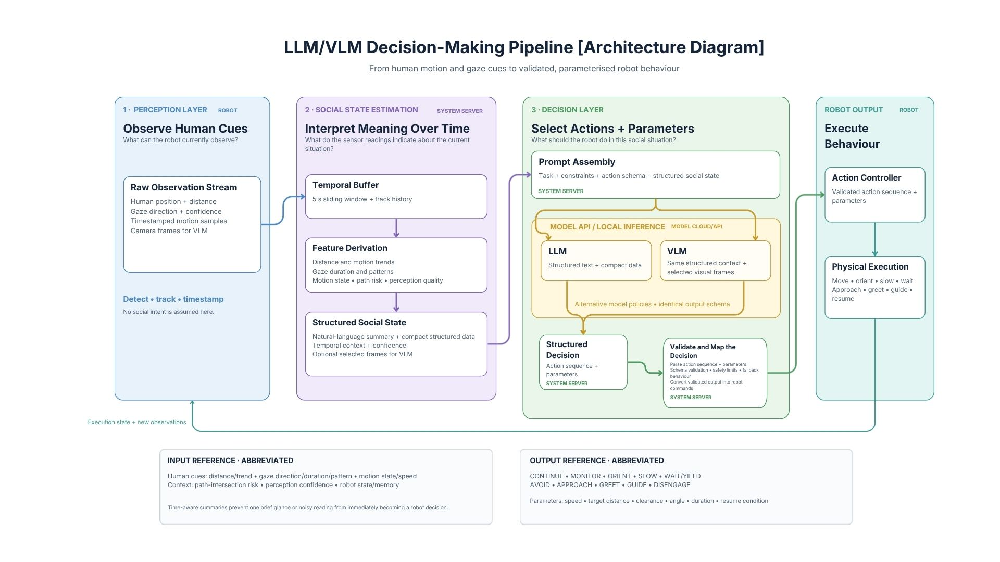

# LLM/VLM Social Navigation Pipeline

This repository contains the first runnable component of the planned social-navigation architecture: a minimal HTTP gateway that accepts an input, sends it to a locally hosted Ollama model, and returns the model output.



## Current scope

Implemented now:

```text
Navel or test client
        |
        | HTTP POST /chat
        v
Python gateway (port 6000)
        |
        | OpenAI-compatible API
        v
Ollama (127.0.0.1:11434)
        |
        v
Qwen 2.5 model
```

This milestone only verifies LLM input and output. Perception, temporal social-state estimation, structured action selection, validation, VLM input, and physical robot control are intentionally not implemented yet.

Ollama is the local model runtime. It performs inference on the computer where it is installed; requests are not sent to an Ollama cloud model. The Python gateway and Ollama are expected to run on the same server computer by default. Navel calls the gateway using that computer's LAN IP address.

## Repository layout

```text
app/
  config.py       Environment configuration
  llm.py          Ollama client
  server.py       Flask API
client.py         Minimal client for Navel or another computer
docs/
  architecture.jpg
tests/
  test_server.py  Offline API tests
.env.example
requirements.txt
```

## Prerequisites

- Python 3.10 or newer
- Ollama installed on the server computer
- Enough CPU/GPU memory for the selected model

Install and start Ollama according to the installation instructions for the server's operating system, then download the default model:

```bash
ollama pull qwen2.5:7b
ollama serve
```

Confirm that Ollama is available:

```bash
curl http://127.0.0.1:11434/api/tags
```

## Install the gateway

From the repository root:

```bash
python3 -m venv .venv
source .venv/bin/activate
python3 -m pip install -r requirements.txt
cp .env.example .env
```

The defaults in `.env.example` use the same local Ollama arrangement as the previous codebase:

```env
OLLAMA_HOST=127.0.0.1
OLLAMA_PORT=11434
OLLAMA_MODEL=qwen2.5:7b
API_HOST=0.0.0.0
API_PORT=6000
```

Start the gateway:

```bash
python3 -m app.server
```

## Test input and output

Check both the Ollama connection and selected model:

```bash
curl http://127.0.0.1:6000/health
```

Send an input to the model:

```bash
curl -X POST http://127.0.0.1:6000/chat \
  -H 'Content-Type: application/json' \
  -d '{"message":"Reply with exactly: LLM connection successful"}'
```

Example response:

```json
{
  "provider": "ollama",
  "model": "qwen2.5:7b",
  "input": "Reply with exactly: LLM connection successful",
  "output": "LLM connection successful"
}
```

You can perform the same test with the included Python client:

```bash
python3 client.py "Reply with exactly: LLM connection successful"
```

An optional system prompt and temperature can also be supplied:

```json
{
  "message": "A person is crossing the robot's path. What should it do?",
  "system_prompt": "You are a cautious social-navigation assistant.",
  "temperature": 0.2
}
```

## Connect from Navel or another network computer

Find the LAN IP of the computer running this gateway. If it is `192.168.1.100`, send requests from Navel to:

```text
http://192.168.1.100:6000/chat
```

Port `6000` must be permitted by the server firewall. Ollama can remain bound to `127.0.0.1`; only this gateway needs to be exposed to the robot network.

Do not configure the Navel robot to use `127.0.0.1`, because that address would refer to Navel itself. It must use the gateway computer's actual LAN IP.

The included dependency-free client can be copied to or run on Navel:

```bash
python3 client.py \
  --server http://192.168.1.100:6000 \
  "Reply with a short connection confirmation"
```

## API

### `GET /health`

Checks whether Ollama is reachable and whether `OLLAMA_MODEL` is installed. It returns HTTP `503` if the runtime or selected model is unavailable.

### `POST /chat`

Request body:

```json
{
  "message": "Required input string",
  "system_prompt": "Optional instruction",
  "temperature": 0.2
}
```

Successful responses contain `provider`, `model`, `input`, and `output`. Upstream Ollama failures return HTTP `502`.

## Run tests

The tests use a fake model, so they do not need Ollama:

```bash
python3 -m unittest discover -s tests -v
```

## Next milestone

The next step is to replace free-form `/chat` output with a strict social-navigation decision schema. The decision layer should select only approved high-level actions and parameters. A deterministic safety controller must validate those decisions before any physical behaviour is executed.
