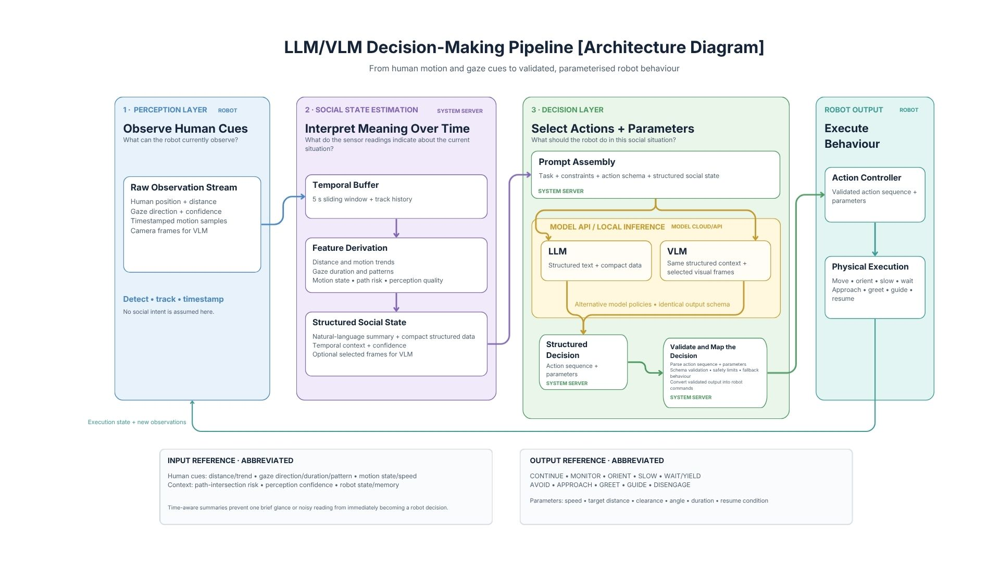

# LLM/VLM Social Navigation Pipeline

This repository contains a social-navigation proof of concept: canonical
observation contracts, synthetic/replay sources, temporal state estimation,
event-driven decision scheduling, and an HTTP gateway to a locally hosted Ollama
model. It also includes a Navel-side collector that reads SDK data and sends
canonical observations. Bounded approaches to pipeline-selected people can be enabled
explicitly; the client defaults to dry-run.



## Current scope

Implemented Navel-to-LLM runtime path:

```text
Navel next_frame + next_locomotion
  -> NavelObservationAdapter
  -> ObservationFrame
  -> HTTP POST /api/v1/observations
  -> TemporalSocialStateEstimator
  -> SocialState
  -> DecisionScheduler
  -> LLMPolicyBridge
  -> Ollama structured response
  -> validated BehaviorIntent in the HTTP response
  -> local freshness/target admission -> typed command -> asynchronous approach handler
  -> shared runtime -> bounded approach -> explicit execution outcome
```

The simpler `POST /chat` route remains available only as an Ollama connectivity
diagnostic. The robot pipeline uses `POST /api/v1/observations`.

This path is covered offline with Navel SDK-shaped perception and locomotion
objects, a real local HTTP request, and a fake structured LLM. A live test still
requires the Navel SDK and sockets on the robot, a network route to the gateway,
and the configured Ollama model on the lab computer. VLM input is not implemented.
The supplied standalone approach scripts were previously hardware-tested; this
new pipeline integration has only been tested without physical hardware.

Ollama is the local model runtime. It performs inference on the computer where it is installed; requests are not sent to an Ollama cloud model. The Python gateway and Ollama are expected to run on the same server computer by default. Navel calls the gateway using that computer's LAN IP address.

## Repository layout

```text
app/
  adapters/       Synthetic and future robot/replay observation sources
  config.py       Environment configuration
  decision/       Event scheduler and schema-constrained LLM policy bridge
  domain/         Versioned pipeline contracts and schema generator
  llm.py          Ollama client
  server.py       Flask API
  state/          Temporal social-state estimation
robot/
  navel_client/   Shared sensors, transport, intent admission and bounded approach
client.py         Minimal client for Navel or another computer
docs/
  architecture.jpg
schemas/v1/       Generated JSON Schemas for public contracts
tests/
  test_server.py  Offline chat API tests
  test_navel_adapter.py
  test_navel_server_e2e.py
  test_observation_pipeline.py
requirements.txt
```

## Prerequisites

- Python 3.10 or newer
- Ollama installed on the server computer
- Enough CPU/GPU memory for the selected model

These are server prerequisites. The server dependencies, including Pydantic,
are listed in `requirements.txt`. The robot-side dependency boundary is
documented separately in `requirements-navel.txt`.

Install and start Ollama according to the installation instructions for the server's operating system, then download the default model:

```bash
ollama pull qwen2.5:7b
ollama serve
```

Confirm that Ollama is available:

```bash
curl http://127.0.0.1:11434/api/tags
```

## Install the gateway

From the repository root:

```bash
python3 -m venv .venv
source .venv/bin/activate
python3 -m pip install -r requirements.txt
```

The application defaults use a local Ollama arrangement. Override them through
the environment or a local `.env` file when needed:

```env
OLLAMA_HOST=127.0.0.1
OLLAMA_PORT=11434
OLLAMA_MODEL=qwen2.5:7b
API_HOST=0.0.0.0
API_PORT=6060
```

Start the gateway:

```bash
python3 -m app.server
```

## Pipeline Lens monitor

Pipeline Lens is the local shadow-mode recorder and replayer included with the
gateway. It visualizes each observation as it moves through validation, social
state estimation, scheduling, policy selection, and intent validation. Replays
use fresh estimator/scheduler state and never call a robot actuation API.

Build the web client once:

```bash
cd web
npm install
npm run build
cd ..
```

Then start the gateway and open `http://127.0.0.1:6060`. The monitor discovers
the checked-in synthetic JSONL recordings automatically. Select a recording to
create an isolated replay, then use restart, play/pause, single-step, speed, the
timeline, stage cards, transition diff, payload inspector, and latency view.

For frontend development, leave the gateway running and use `npm run dev` from
`web/`; Vite serves the UI at `http://127.0.0.1:5173` and proxies monitor API
requests to port 6060.

Live Navel observations continue to use `POST /api/v1/observations`. Connected
sources appear automatically, and the record control stores canonical
observations plus `trace.jsonl` under the ignored `var/recordings` directory.
The monitor is deliberately read-only with respect to connected robots.

## Test input and output

Check both the Ollama connection and selected model:

```bash
curl http://127.0.0.1:6060/health
```

Send an input to the model:

```bash
curl -X POST http://127.0.0.1:6060/chat \
  -H 'Content-Type: application/json' \
  -d '{"message":"Reply with exactly: LLM connection successful"}'
```

Example response:

```json
{
  "provider": "ollama",
  "model": "qwen2.5:7b",
  "input": "Reply with exactly: LLM connection successful",
  "output": "LLM connection successful"
}
```

You can perform the same test with the included Python client:

```bash
python3 client.py "Reply with exactly: LLM connection successful"
```

An optional system prompt and temperature can also be supplied:

```json
{
  "message": "A person is crossing the robot's path. What should it do?",
  "system_prompt": "You are a cautious social-navigation assistant.",
  "temperature": 0.2
}
```

## Connect from Navel or another network computer

Find the LAN IP of the computer running this gateway. If it is `192.168.1.100`,
the Navel observation client should use this gateway base URL:

```text
http://192.168.1.100:6060
```

`ObservationTransport` appends `/api/v1/observations`. Do not point the Navel
pipeline at `/chat`; that endpoint accepts free-form text, not an
`ObservationFrame`.

Port `6060` must be permitted by the server firewall. Ollama can remain bound to `127.0.0.1`; only this gateway needs to be exposed to the robot network.

Do not configure the Navel robot to use `127.0.0.1`, because that address would refer to Navel itself. It must use the gateway computer's actual LAN IP.

The separate dependency-free `client.py` checks only the optional `/chat`
diagnostic and does not exercise the observation pipeline:

```bash
python3 client.py \
  --server http://192.168.1.100:6060 \
  "Reply with a short connection confirmation"
```

## API

### `GET /health`

Checks whether Ollama is reachable and whether `OLLAMA_MODEL` is installed. It returns HTTP `503` if the runtime or selected model is unavailable.

### `POST /chat`

Request body:

```json
{
  "message": "Required input string",
  "system_prompt": "Optional instruction",
  "temperature": 0.2
}
```

Successful responses contain `provider`, `model`, `input`, and `output`. Upstream Ollama failures return HTTP `502`.

### `POST /api/v1/observations`

Accepts one canonical `ObservationFrame`. It always performs contract validation
and temporal estimation. The scheduler calls the LLM only for a social event or
active-scene refresh, unless `?force_decision=1` is supplied for a short
diagnostic.

When a decision is triggered successfully, the response contains a complete
`BehaviorIntent`:

```json
{
  "accepted": true,
  "observation_id": "navel-5010005:123456789:000001",
  "social_state_id": "state-...",
  "decision_triggered": true,
  "forced_decision": false,
  "triggers": ["HUMAN_DETECTED"],
  "behavior_intent": {
    "schema_version": "1.0",
    "decision_id": "decision-...",
    "observation_id": "navel-5010005:123456789:000001",
    "social_state_id": "state-...",
    "created_at_us": 123456789,
    "action": "ORIENT",
    "target_human_id": "17",
    "preferences": {
      "target_speed_mps": null,
      "preferred_social_distance_m": null,
      "passing_side": null,
      "orientation_target_rad": 0.0,
      "hold_duration_s": null
    },
    "valid_for_ms": 1000,
    "reason_codes": ["HUMAN_DETECTED"],
    "decision_confidence": 0.75
  }
}
```

An accepted frame can legitimately return `"behavior_intent": null` when the
scheduler finds no reason to call the model.

## Run tests

The tests use a fake model, so they do not need Ollama:

```bash
python3 -m unittest discover -s tests -v
```

## Domain contracts

The robot-independent pipeline contracts are strict Pydantic models in
`app/domain/models.py`:

- `ObservationFrame` contains synchronized raw observations and image references.
- `SocialState` contains temporal, derived, and uncertainty-aware social state.
- `BehaviorIntent` contains a high-level policy proposal that must be validated
  before execution.

Their versioned JSON Schema files are committed under `schemas/v1/`. Regenerate
them after changing a model:

```bash
python3 -m app.domain.schema
```

The test suite fails if the committed schemas do not match the models.

## Synthetic museum and laboratory scenarios

The synthetic adapter produces deterministic, contract-valid `ObservationFrame`
sequences for newcomer encounters without requiring Navel or Ollama. Exact map
trajectories and scenario labels are kept in separate ground truth so they do not
leak into perception inputs.

List the available guide-robot scenarios:

```bash
python3 -m app.adapters.synthetic --list
```

Export one scenario as replayable newline-delimited JSON:

```bash
python3 -m app.adapters.synthetic \
  --scenario newcomer_requests_guidance \
  --output recordings/synthetic/newcomer_requests_guidance.jsonl
```

Optional position noise, gaze noise, and observation dropout are deterministic
for a supplied seed:

```bash
python3 -m app.adapters.synthetic \
  --scenario newcomer_occluded_by_exhibit \
  --output recordings/synthetic/noisy_occlusion.jsonl \
  --seed 42 \
  --position-noise-std-m 0.05 \
  --gaze-noise-std 0.03 \
  --dropout-probability 0.05
```

The initial catalogue covers requests for guidance, non-engaging passersby,
path crossing, normal following, falling behind, exhibit occlusion, and a pair
of newcomers requesting guidance.

## Reading observation JSONL

`JsonlObservationIterator` streams recordings without loading the complete file
into memory. Each line is validated as an `ObservationFrame`, and timestamps
must be strictly increasing by default:

```python
from app.adapters.jsonl import JsonlObservationIterator

source = JsonlObservationIterator(
    "recordings/synthetic/newcomer_requests_guidance.jsonl"
)
for observation in source:
    # Pass only the observation to temporal state estimation.
    print(observation.observation_id, observation.timestamp_us)
```

Ground truth is deliberately available only through the separate record API:

```python
for record in source.iter_records():
    observation = record.observation
    ground_truth = record.ground_truth  # Evaluation only; never model input.
```

Set `require_ground_truth=True` for evaluation jobs that should fail if labels
are absent. Malformed JSON, contract violations, empty files, and non-monotonic
timestamps raise `JsonlObservationError` with the source path and line number.

## Temporal social-state estimation

The deterministic MVP estimator consumes every observation and emits one
contract-valid `SocialState`. It maintains five seconds of per-person history
and derives basic motion, distance trend, gaze history, attention, engagement,
short-occlusion prediction, proxemics, and crowd counts:

```python
from app.adapters.jsonl import JsonlObservationIterator
from app.state import TemporalSocialStateEstimator

observations = JsonlObservationIterator(
    "recordings/synthetic/newcomer_requests_guidance.jsonl"
)
estimator = TemporalSocialStateEstimator()

for social_state in estimator.process(observations):
    print(social_state.state_id, social_state.humans)
```

Use a fresh estimator per experiment or call `reset()` before starting another
recording. The MVP requires monotonic `ROBOT_BASE` observations. Missing cues
remain unknown, and a missing track is retained for up to two seconds as
`predicted_only` with increasing uncertainty. Ground truth never enters the
estimator.

This version uses transparent thresholds and finite differences. Kalman
filtering, rotation-aware ego-motion compensation, advanced trajectory and path
conflict prediction, group inference, learned engagement, and crowd-flow
estimation remain later improvements.

## Event-driven decision scheduling

`DecisionScheduler` examines every `SocialState` but requests a model decision
only when the social situation changes or an active-scene refresh is due:

```python
from app.decision import DecisionScheduler

scheduler = DecisionScheduler()
for social_state in estimator.process(observations):
    request = scheduler.evaluate(social_state)
    if request is None:
        # Maintain the controller's existing behaviour: initially, keep roaming.
        continue

    print(request.trigger_codes)
    # intent = policy.decide(request.state)
```

The first detected human triggers a decision so the future policy can choose
between continuing the fixed roaming route and actions such as approaching or
greeting. Further triggers include human departure, motion, distance trend,
attention, engagement, speaking, proxemic-zone, robot-context, occlusion, and
reacquisition changes. Events within the default 0.5-second minimum interval
are coalesced, and an active human scene is refreshed every two seconds even if
no discrete event occurs. Empty unchanged scenes do not invoke the model.

Use a fresh scheduler per experiment or call `reset()`. Timing and departure
behaviour are configurable through `SchedulerConfig`.

## Navel observation-to-policy pipeline

One `navel.Robot()` connection has one `next_frame()` reader and one
`next_locomotion()` reader. `main.py` feeds `navel_runtime.py` and the observation
adapter from those collectors. HTTP runs in a worker thread, and the response
loop submits actions without awaiting movement. Sensor processing and observation
sending continue throughout the action.

```text
behavior_intent -> parser -> mapper -> admission -> async dispatcher
  -> behavior/handlers/approach_human.py
  -> behavior/actions/approach_human.py -> shared navel_runtime.py
  -> BehaviorExecutionSnapshot + ApproachResult
```

The controller owns the active task and records its result or exception. Admission
results (including rejected requests) are separate from the accepted execution.
The runtime owns raw packets, receipt times, synchronized odometry history,
position association and exclusive movement. It has no reader-starting method.
No extra robot connection or event loop is created by the action.

The prompt and its research rationale are documented in
[`docs/llm-policy-prompt-design.md`](docs/llm-policy-prompt-design.md).

Server state is isolated by `capabilities.adapter_id`. Give each robot or replay
source a stable unique adapter ID. A non-increasing timestamp for the same ID is
rejected with HTTP 409 instead of resetting temporal history silently.

### Laptop/server setup

From the repository root:

```bash
python3 -m venv .venv
source .venv/bin/activate
python3 -m pip install -r requirements.txt
ollama pull qwen2.5:7b
```

Start Ollama in one terminal:

```bash
ollama serve
```

Start the gateway in another:

```bash
source .venv/bin/activate
API_HOST=0.0.0.0 python3 -m app.server
```

Confirm the selected model is reachable:

```bash
curl http://127.0.0.1:6060/health
```

Only the Flask port needs to be reachable from the robot. Keep Ollama local when
possible. The Navel command must use the laptop's LAN address, not `127.0.0.1`.

### Navel setup and usage

Use Python 3.11+ and the robot-provided Navel SDK (the supplied algorithm targets
0.15.3). No extra robot-side PyPI dependencies are needed. From this repository's
root on the robot, with the gateway running on the example LAN address:

```bash
# Default: validate/acquire/preview, without movement, stop or speech commands.
python3 -m robot.navel_client.main --server http://192.168.1.100:6060 --adapter-id navel-5010005

# Explicitly enable pipeline-requested bounded approach movement.
python3 -m robot.navel_client.main --server http://192.168.1.100:6060 --adapter-id navel-5010005 --execute

# Sensor-only diagnostic, without HTTP.
python3 -m robot.navel_client.main --print-only
```

Replace `192.168.1.100` with the gateway's actual LAN address. `--force-decision`
is an optional scheduling diagnostic. `--execute` cannot be combined with
`--print-only` or `--stationary-velocity-fallback`. The latter is an explicit
stationary-only diagnostic for unavailable odometry. In execution mode, stale
odometry causes observations to be skipped and movement to fail and stop.
No greeting or other speech is implemented. The demo's automatic drive,
nearest-person trigger and detection announcement are absent.

### Target, coordinates and parameters

Only `APPROACH` has an executable handler. All 12 server action names still parse
and map. The other 11 placeholder handlers have been removed.

`target_human_id` must be a canonical nonnegative integer UID string found in the
referenced locally generated Navel observation. IDs from other sources, unknown
observations, missing positions, ambiguity and stale targets are rejected; there
is no nearest-person fallback. Up to 2,048 local observation contexts are retained
for at most 60 seconds. Their position associations advance with incoming frames,
so an ordinary UID change during an HTTP response delay can be resolved. The
supplied 0.5 m association gate, 0.20 m ambiguity margin, 2 s loss limit, and
0.35 m acquisition gate are retained. New executions reset target/acquisition
state, while keeping the connection and readers.

The live adapter and movement share `g_nose`, transformed from `HEAD_STRAIGHT`
(SDK coordinate 3) into the base plane. They do not use `g_head_position` or
`dist_mm` as a conflicting movement measurement. Forward is +x, left is +y.
The supplied default assumes the head origin is vertically above the wheel
rotation centre and aligned forwards. Calibration options are `--head-x`,
`--head-y` (each within ±0.5 m), and `--frame-yaw-deg` (within ±45°).
Published `position_robot_m` projects the nose onto the horizontal base plane
(`z=0`); height is not calibrated. `distance_m` is its horizontal norm.

The shared decoder handles standard planar quaternions and the supplied SDK
0.15.3 positional-layout workaround: quaternion x/y encode yaw, and velocity
`linear_y` encodes yaw rate. In that layout it is **not lateral velocity**.
The live adapter publishes the same decoded yaw rate and forward velocity as the
action. SDK timestamps are treated as microseconds for nearest-pose alignment
(maximum skew 180 ms); duplicate/backward packets do not refresh local state.
As in the supplied runtime, absent SDK timestamps use receipt-time freshness and
the latest pose, with weaker alignment assurance. Odometry expires after 0.6 s,
perception after 0.8 s; initial target positions must be current within 0.4 s.

`preferred_social_distance_m` is required and applied directly, supported from
0.6 to 1.5 m. It measures **horizontal wheel-rotation-centre to estimated nose**,
not shell-to-body clearance. Optional `target_speed_mps` must be finite and
positive. Its applied cap is `min(request, 0.25)` m/s, defaulting to 0.25 m/s;
curved motion may reduce speed further to keep angular speed at most 70°/s.
Execution results record requested distance/speed and applied distance/speed cap;
`APPROACH_ARC` logs record each actual arc speed. Single-arc length is at most
4 m and angle at most 100°; acquisition is within 4 m and ±60°.

### Admission, expiry and cancellation

- Decision IDs are deduplicated in a bounded history of 256 parsed requests,
  including rejected ones. A repeated ID returns `DUPLICATE`.
- Same-target requests while active return `ALREADY_RUNNING`; another target
  returns `BUSY`. Nothing is queued. Null intents leave execution unchanged.
- Recognized unimplemented actions return `UNSUPPORTED_ACTION`, including WAIT
  and AVOID during an approach. They neither cancel nor replace it and issue no
  actuator command. Unknown/malformed intents return `INVALID_INTENT`.
- The server's `created_at_us` is copied from `SocialState.timestamp_us`, which
  comes from the source observation's **client host monotonic clock**. Admission
  requires an exact retained observation/timestamp match. Expiry is source time
  plus `valid_for_ms`, compared with that same local clock. SDK and server-host
  clocks are never compared with it. Slow LLM/HTTP responses may already be
  expired; receipt never renews validity. Unknown clock origins fail closed.
- Fresh median target sampling and expiry are rechecked after acquisition before
  movement. Once admitted and started before expiry, the bounded movement may
  finish after expiry. Expiry during acquisition fails the execution.
- `await controller.cancel_active()` is the explicit application cancellation
  path. Ctrl+C/SIGTERM invoke shutdown. The SDK sender is cancelled and awaited
  before zero-velocity commands; new odometry must confirm stopping. Readers
  remain alive until cleanup finishes. Stop failure records `FAILED`/`FAULT`
  and latches a lockout; restart only after independently confirming the base
  has stopped. There is no automatic reset or queued retry.

Execution snapshots distinguish `ACCEPTED`, `RUNNING`, `DRY_RUN_COMPLETED`,
`COMPLETED`, `CANCELLED`, and `FAILED`. Results carry decision ID, requested and
resolved target, parameters, distance, heading error and live verification.
Admission rejection does not replace the running snapshot. Existing observation
fields show `APPROACHING/ACTIVE` while execution runs, `COMPLETE/STOPPED` when a
bounded execution finishes, and `ERROR/FAULT` on failure. COMPLETE means the
execution ended, **not verified arrival**; the schema has no approach-result
field, so detailed outcomes remain in controller state and logs. No new server
endpoint is added.

### Reusing the approach

Inside an existing asynchronous application whose collectors feed this runtime:

```python
from robot.navel_client.behavior.actions.approach_human import approach_human

# runtime.cfg.execute is false by default. Configure stand-off/speed before use.
# No other wheel controller may be active; UID explicitly identifies the person.
result = await approach_human(runtime, uid=17)
# result is None for dry-run; otherwise inspect result.status and verification.
```

Pipeline callers should use `BehaviorController(runtime=runtime)` so source,
expiry and deduplication checks also apply. Direct callers own those admission
checks; optional `seed` and local-monotonic `deadline` can carry validated context.
Do not start additional readers or call `asyncio.run()` inside the action.

### Algorithm limits and validation status

The supplied algorithm is retained: fresh median nose samples, a fixed target for
each curved approach, odometry monitoring, at most one terminal distance
correction, and at most two final body-heading corrections. Losing the face
mid-arc does not automatically cancel it. Memory-based completion is
`APPROACHED_UNVERIFIED`; fresh estimates within ±0.10 m and ±4° give
`APPROACHED_VERIFIED`; fresh estimates outside those tolerances give
`OUTSIDE_TOLERANCE`. Verification refers to sensors, not external ground truth.

There is no continuous tracking/replanning, lidar obstacle avoidance, long-gap
re-identification, route resumption or head/eye control. The observed-person
0.50 m stop check cannot protect against unseen people or obstacles. The braking
estimate and head transform require hardware calibration. Run no other wheel or
head-control scripts during eventual controlled hardware validation.

Prior standalone-script hardware testing does **not** validate this integration.
The integrated pipeline is tested only with mocks, mathematical checks, and a
local HTTP server/fake LLM. Physical validation of the integrated approach,
calibration, stop response and realistic LLM latency remains outstanding.

### Observation API

`POST /api/v1/observations` accepts exactly one canonical `ObservationFrame`.
Invalid contracts return HTTP 400. Out-of-order frames return HTTP 409. An LLM
provider failure or invalid structured selection returns HTTP 502 while retaining
`"accepted": true`, because estimation and scheduling have already succeeded
and their temporal state is preserved.

For a single manual end-to-end check, use:

```text
POST /api/v1/observations?force_decision=1
```

The `triggers` array contains only actual `DecisionTrigger` enum values. A forced
decision with no scheduler event therefore returns an empty trigger array and
`"forced_decision": true`.

### Verification

```bash
python3 -m unittest discover -s tests -v
```

Tests cover parsing and routing, target/freshness admission, deduplication,
exclusive motion, transport progress during approach, shared sensor readers,
shutdown ordering, dry-run isolation, face loss, distance/alignment corrections,
second-target execution, and stop/odometry failures. The HTTP test needs local
loopback socket permission. Tests construct only mock robot connections.
