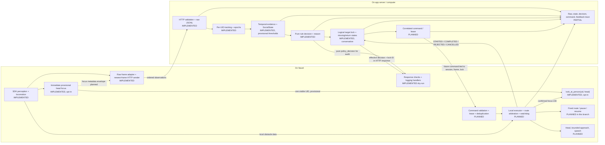

# Completed rule-based Navel interaction system

This is the target architecture for a robot roaming a fixed route. **Implemented**
means present in this branch; **planned** means the behavior or interface still
needs to be built. A rule decision is a proposal until the robot validates and
executes a correlated command.

## System diagram

With `--head-focus`, the focus controller runs on every robot perception packet,
before the rate-limited HTTP sender. Thus the head can respond to the first
eligible detection without waiting for the server. Its focus is **provisional**. The
server owns the logical interaction lock. A validated response pins the robot's
head acquisition to the selected UID while the response remains current. The
robot must not treat local head focus as permission
to approach or speak.

The [Navel SDK](https://doc.navelrobotics.com/api/communication.html) documents
`look_at_person(uid, head)`, where `head=0` requests no head movement and `head=1`
requests maximum head movement relative to eye movement. The docs do not specify
how focus ends or what happens after a UID disappears; verify both on the installed
robot before enabling automatic head movement.

## Data and ownership

| Data or state | Owner | Purpose / status |
| --- | --- | --- |
| Robot monotonic observation time, SDK UID, distance, gaze overlap, base velocities | Robot raw stream | Already sent; used by tracking, social estimation, and rules. |
| Optional `CAM_HEAD` head position | Robot raw stream | Already supported, but absent in all seven pilot recordings. Use for reassociation only after live availability and motion tests. |
| Optional face bounding box | Robot raw stream | Planned: image position and size for short-gap reassociation; not an identity by itself. |
| Local focused UID and last-seen time | Robot focus controller | Implemented behind `--head-focus`; one unambiguous UID, short loss grace, SDK command and event logs. Focus epoch, modes, and server correlation remain planned. A command log is not measured head pose. |
| Base route and head-motion/settling status | Robot controller | Planned: distinguish a stationary base from a moving camera. If actual head motion is unavailable, treat camera motion as uncertain until focus is held and a measured settling interval passes. |
| `(session_id, uid, track_epoch)` | PC tracker | Implemented track key; changing UID or expired epoch remains a distinct raw history. |
| Logical `lock_id`, selected UID/epoch, bound tracks, status, missing hold, release cooldown | PC target lock | Implemented; a changed UID can inherit the logical lock after a short exclusive, distance-consistent multi-frame handoff. Actual completion and validated identity accuracy remain planned. |
| Command ID, source state, lock ID, target UID/epoch, expiry, capability | PC command protocol | Planned: robot validates before any action. |
| Execution events and local safety/route state | Robot executor | Planned: feedback closes the loop; lidar/sonar are local obstacle inputs, not person identity evidence. |

`id_score` is not a lock input yet: the
[public Person reference](https://doc.navelrobotics.com/api/data_structs.html)
lists it without defining its meaning or scale. `set_persist` and `get_id_store`
can be tested separately as optional recognition aids; neither replaces the
short-term lock or supplies a documented match decision for a new UID.

## Rule output versus interaction intent

The pure rule evaluates one SocialState and returns a reasoned proposal. The
implemented lock layer holds an interaction through brief loss, can hand off
to a new UID under guarded evidence, and gates that proposal. Completion and
validated identity accuracy remain planned:

| Current evidence | Pure rule today | Completed lifecycle |
| --- | --- | --- |
| No visible person | `CONTINUE` | Continue only with no active/missing lock; otherwise hold through the bounded return window. |
| Multiple visible people, too close, or invalid evidence | `DEFER` | Retain or release the current lock by explicit lifecycle rules; do not select a new target opportunistically. |
| Valid no attention or person moving away | `CONTINUE` | Release or enter cooldown as appropriate before route resume. |
| Sustained gaze plus valid toward/stationary motion in approachable range | `APPROACH` | Issue at most one bounded approach command after route and robot-local checks. |
| Sustained gaze plus valid toward/stationary motion in interaction range | `ENGAGE` | Issue one engagement command per logical interaction; wait for completion feedback before cooldown. |
| Verified route conflict | No current input; `YIELD` is never emitted | Add only after route-conflict geometry and robot-local yield behavior are validated. |

## Target-lock state and decisions

| State | Entry and behavior | Exit |
| --- | --- | --- |
| `ROAMING` | No target. Continue the fixed route. On one eligible visible person, robot creates a focus epoch and calls `look_at_person`; multiple people do not trigger arbitrary selection. | `FOCUSED` |
| `FOCUSED` | Head follows a provisional UID while raw frames reach the PC. Route may continue until the interaction controller requests a controlled pause. No speech or approach. | `LOCKED`, `MISSING`, or `RELEASED` |
| `LOCKED` | PC creates a logical lock for one visible `(session, UID, epoch)`. Pause the route to collect valid social evidence. The pure rule may propose `APPROACH` or `ENGAGE`; a command is sent only if target, freshness, capability, and cooldown gates pass. | `MISSING`, `COOLDOWN`, or `RELEASED` |
| `MISSING` | Keep the logical lock for a bounded interval; hold/observe rather than interpreting `NO_VISIBLE_PERSON` as `CONTINUE`. Cancel active target-specific execution locally. | Same UID returns, `TENTATIVE_RETURN`, or `RELEASED` |
| `TENTATIVE_RETURN` | A different UID is a candidate while exclusive, distance-consistent evidence accumulates. The head remains pinned to the old UID until the server accepts a handoff. Block approach/speech while identity is uncertain; reject ambiguous or competing candidates. | Guarded rebind to `LOCKED`, or `RELEASED` |
| `COOLDOWN` | An interaction completed. Preserve completion and cooldown under the logical lock, including a confidently rebound UID; repeated `ENGAGE` frames do not repeat speech. | `ROAMING` after cooldown/release |
| `RELEASED` | Clear the lock and focus using robot-verified SDK behavior; resume the route only after route ownership is reconciled. | `ROAMING` |

Same UID within the configured tracker grace keeps its track epoch. A different
UID starts a new raw track; a short exclusive, distance-consistent, multi-frame
return can update the logical lock while the raw histories stay separate. This
heuristic can still confuse a different person at a similar distance.
Head-following moves camera-relative positions and tends to center the focused
face. The current handoff deliberately does not use camera-relative position.
Do not add image/relative-position matching until head pose or a settled-camera
condition is verified. Rebuild gaze and distance-trend evidence for the new
track rather than copying measurements across UIDs.

The current temporal estimator checks only base velocity before labeling human
radial motion. The completed estimator must mark this cue unknown while head
motion could explain a range change, or transform measurements into a verified
stable frame. Gaze thresholds also need evaluation with head following enabled.

## Implementation and validation matrix

| Part | Current status | Remaining work | Validation / acceptance evidence |
| --- | --- | --- | --- |
| SDK sampling and HTTP | Implemented: concurrent perception/locomotion collection, latest-frame queue, bounded POST rate and timeout | Keep robot focus independent of the HTTP worker | Unit and real-local-HTTP tests for mapping, nulls, ordering, queue replacement, transport loss; live SDK/LAN timing on Navel. |
| Raw recording and replay | Implemented: strict schema, ordered JSONL, replay | Version any envelope changes and record focus events without rewriting old frames | Old 01-07 files still parse; new-schema round trip and replay produce identical state/decision traces at multiple playback speeds. |
| Robot provisional head focus | Implemented, opt-in, without SDK release | Add focus epoch and PC correlation; determine physical release behavior and navigation coordination | Fake-SDK tests cover immediate first detection, no duplicate calls, no random switch in crowds, timeout and stop. On Navel verify follow duration, UID-loss behavior, release, head limits, and route compatibility. |
| Person tracking | Implemented: UID histories, missing/reacquired/lost events, epochs | Preserve source tracks while exposing candidate matches to the lock layer | Existing 682-frame audit; synthetic same-UID return, changed UID, reused UID, simultaneous candidates, and gaps beyond grace. Never mix raw samples across UIDs. |
| Spatial reassociation | Planned | Add optional face box; use time, distance, and spatial evidence only when camera pose is suitable. No auto-transfer on ambiguity | Human-annotated same-person returns and impostor/crossing trials. Report correct returns, false transfers, unresolved cases, and latency separately. Recordings 01-07 lack 3D head position and identity labels, so they cannot validate this accuracy. |
| Temporal SocialState | Implemented with provisional thresholds | Gate motion evidence during head movement; calibrate gaze and distance with head following on/off | Synthetic cue tests and replay parity; annotated head-on/head-off robot recordings; measure false `APPROACH`/`ENGAGE` in conditions like recordings 04, 05, and 07. |
| Pure rule policy | Implemented: explainable `CONTINUE`, `APPROACH`, `ENGAGE`, `DEFER`; no verified `YIELD` cue | Keep pure table, but let lifecycle override `NO_VISIBLE_PERSON` while a lock is missing | Branch tests for every rule and validity flag; exact reason code/source state on live and replay paths; no target-specific output for missing or ambiguous targets. |
| Interaction lifecycle | Partly implemented: logical lock, guarded UID handoff, missing/return states, stream-gap release, release cooldown, effective decision | Calibrate handoff with labeled return/impostor trials; add completion feedback and greeting cooldown | Deterministic tests cover successful handoff, new epoch, crowd and distance rejection, target loss, stream gap, and replay/live parity. Completed greeting and false-transfer trials remain. |
| Command and feedback protocol | Planned; current HTTP carries policy proposals and robot has logging handlers | Versioned command envelope, IDs, expiry, deduplication, execution events, session restart | Robot-to-PC-to-fake-executor HTTP tests; reject stale, mismatched, duplicate, old-session, lost-target, and unsupported commands; correlate every feedback event. |
| Physical executor and route | Planned in this branch | Local pause/hold/resume ownership, bounded head/approach/speech actions, obstacle checks, physical cancellation and watchdog | One capability at a time on Navel; verify stop after target loss, sensor loss, tunnel loss, stale command, operator override, and route handoff. A dry-run watchdog only clears logs today. |
| Full-loop evaluation | Planned | Freeze configuration and compare complete runs with human labels | Repeated roam-to-interaction scenarios with aligned raw/state/decision/lock/command/feedback traces. Report UID switches, false lock transfers, repeated greetings, missed engagement, latency, and safety overrides. |

## Recommended build order

1. Validate the opt-in robot focus controller's `look_at_person` lifecycle on
   Navel. Determine physical release behavior and log a focus epoch for server
   correlation. Keep the route and speech handlers in dry-run during this step.
2. Validate the logical lock, its `NO_VISIBLE_PERSON` override, and guarded UID
   handoffs on Navel. Collect labeled returns and impostors before physical
   actions use rebound targets.
3. Collect labeled head-follow recordings with face boxes and test spatial
   reassociation and head-motion effects. Set thresholds from those trials.
4. Add command/feedback envelopes and a fake executor; then enable head, route
   pause/resume, speech, and bounded approach one capability at a time.

See [person tracking](person-tracking.md), [temporal state](temporal-social-state.md),
[first rule policy](social-policy.md), [target lock](target-lock.md), and the
[robot decision dry-run](robot-decision-dry-run.md)
for the existing contracts and commands.
